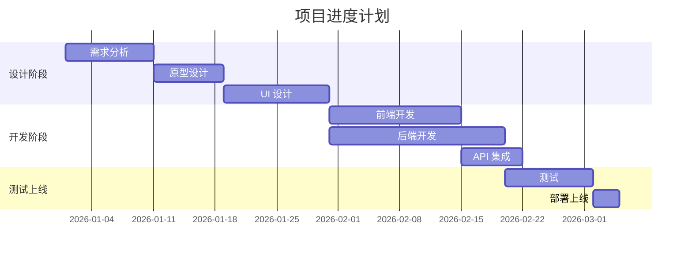
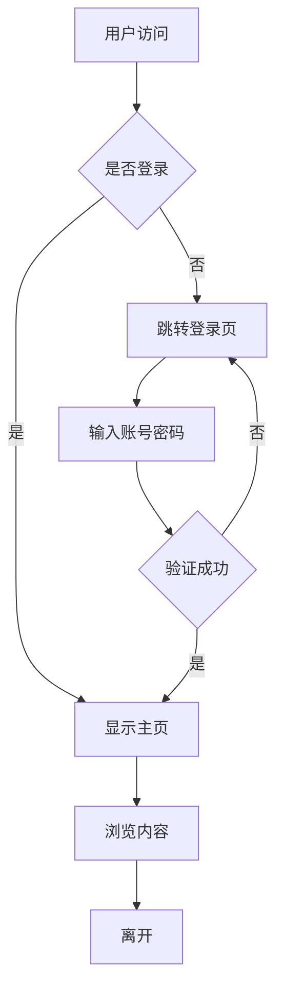
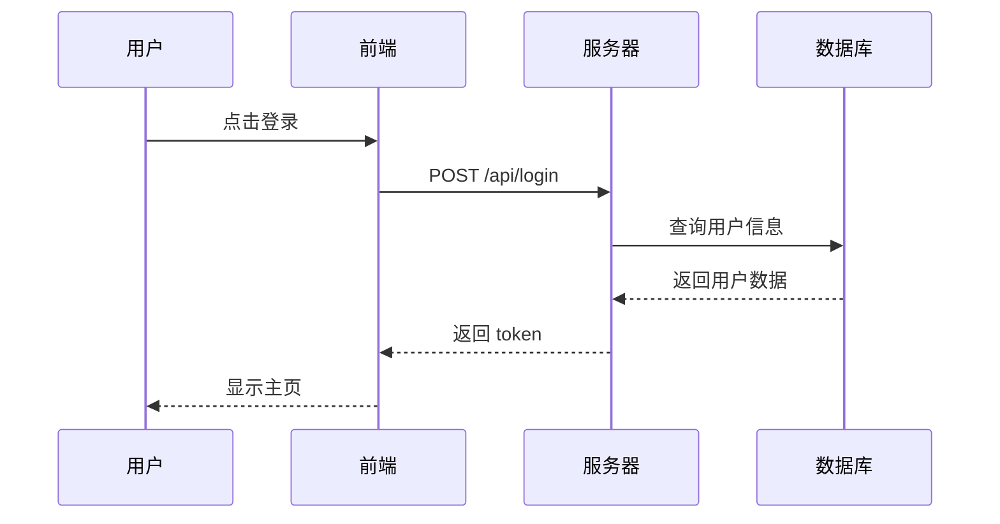
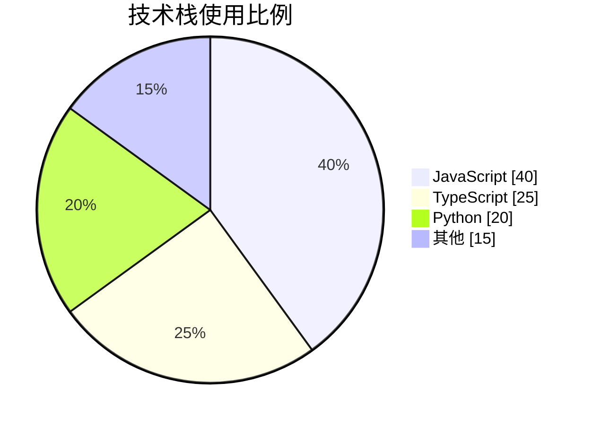
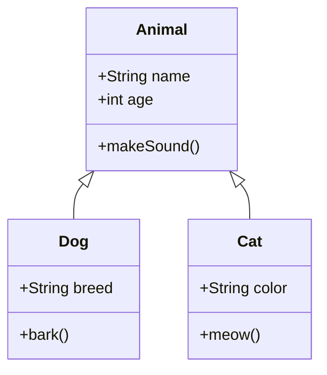

import EChart from "../../../components/EChart.astro";

这是一篇用于测试博客图表功能的文章，包含 **Mermaid** 和 **ECharts** 两种图表方案。

## Mermaid 图表

### 甘特图

### 流程图

### 时序图

### 饼图

### 类图

## ECharts 交互式图表

以下图表支持鼠标悬停、缩放等交互操作，并会自动跟随明暗主题切换。

### 柱状图对比

<EChart option={{
    title: { text: "2026年月度阅读量", left: "center" },
    tooltip: { trigger: "axis" },
    xAxis: { type: "category", data: ["1月", "2月", "3月", "4月", "5月", "6月"] },
    yAxis: { type: "value" },
    series: [{
        type: "bar",
        data: [120, 200, 150, 80, 70, 110],
        barWidth: "40%"
    }]
}} />

### 折线图趋势

<EChart option={{
    title: { text: "文章阅读量趋势", left: "center" },
    tooltip: { trigger: "axis" },
    xAxis: { type: "category", data: ["周一", "周二", "周三", "周四", "周五", "周六", "周日"] },
    yAxis: { type: "value" },
    series: [{
        type: "line",
        data: [820, 932, 901, 934, 1290, 1330, 1320],
        smooth: true,
        areaStyle: { opacity: 0.15 },
        lineStyle: { width: 3 }
    }]
}} />

### 饼图分布

<EChart option={{
    title: { text: "内容类型分布", left: "center" },
    tooltip: { trigger: "item" },
    legend: { bottom: "0%" },
    series: [{
        type: "pie",
        radius: ["40%", "70%"],
        avoidLabelOverlap: true,
        itemStyle: { borderRadius: 6 },
        label: { formatter: "{b}: {d}%" },
        data: [
            { name: "技术文章", value: 35 },
            { name: "生活随笔", value: 25 },
            { name: "读书笔记", value: 20 },
            { name: "影视评论", value: 20 }
        ]
    }]
}} />

### 雷达图能力评估

<EChart option={{
    title: { text: "技能雷达图", left: "center" },
    tooltip: { trigger: "item" },
    radar: {
        indicator: [
            { name: "前端", max: 100 },
            { name: "后端", max: 100 },
            { name: "设计", max: 100 },
            { name: "运维", max: 100 },
            { name: "算法", max: 100 }
        ]
    },
    series: [{
        type: "radar",
        data: [{
            name: "当前水平",
            value: [85, 70, 65, 55, 60],
            areaStyle: { opacity: 0.3 }
        }]
    }]
}} />

### 仪表盘进度

<EChart option={{
    title: { text: "项目完成度", left: "center" },
    series: [{
        type: "gauge",
        progress: { show: true, width: 14 },
        axisLine: { lineStyle: { width: 14 } },
        detail: {
            valueAnimation: true,
            formatter: "{value}%",
            fontSize: 24,
            offsetCenter: [0, "70%"]
        },
        data: [{ value: 78 }]
    }]
}} />

### 漏斗图转化

<EChart option={{
    title: { text: "用户转化漏斗", left: "center" },
    tooltip: { trigger: "item" },
    series: [{
        type: "funnel",
        left: "15%",
        top: 40,
        bottom: 40,
        width: "70%",
        min: 0,
        max: 1000,
        sort: "descending",
        gap: 4,
        label: { show: true, position: "inside" },
        data: [
            { name: "访问", value: 1000 },
            { name: "注册", value: 600 },
            { name: "活跃", value: 350 },
            { name: "付费", value: 120 }
        ]
    }]
}} />

## 总结

本博客现已支持以下图表类型：

| 方案 | 支持类型 | 交互性 |
|------|---------|--------|
| **Mermaid** | 流程图、时序图、甘特图、类图、状态图、饼图、思维导图 | 静态 SVG |
| **ECharts** | 柱状图、折线图、饼图、散点图、雷达图、仪表盘、漏斗图、桑基图、树形图 | 完整交互 |

在 Markdown 中直接使用 `mermaid` 代码块即可渲染 Mermaid 图表，在 MDX 中通过 `<EChart>` 组件可创建交互式图表。
